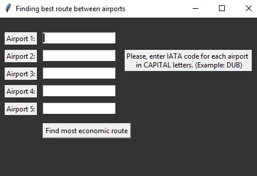
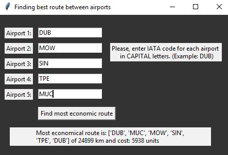

# Python-Airports-Project
Project in Python, to get most economical possible route between 5 airports
## Description
This program takes input of 5 airports codes in ITA format in capital letters from user via GUI, 
returns most economical route, total distance and cost. 
Same data also saved to csv file “bestroute.csv”. If file doesn’t exist, it’s created, if exist – it’s overwritten.

To get the cheapest route, weighted distance is considered. Prices of fuel in ther airports are weights for the distance. So, after user entered airport code, program finds airport country, currency and exchange rate to EUR. Exchange rate is the weight for the flight from that airport.

Program checks for correct user input:
* If all entry fields have data
* If data in entry fields are valid airport codes
## Prerequisites
Download and install Python
## Start
Run main.py, enter 5 IATA airports codes
## Images

